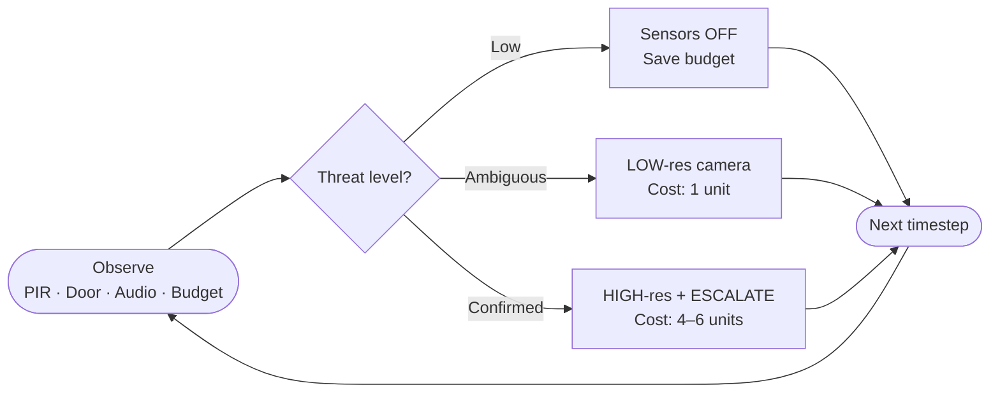

## Introduction and Motivation

Your home camera is probably watching you right now. Not because you're in danger — because nobody programmed it to know the difference.

The proliferation of smart home sensors — doorbell cameras, PIR motion detectors, always-listening voice assistants — has made residential security powerful and pervasive at the same time. Rich sensor data enables reliable intrusion detection. But continuous, high-fidelity capture of in-home activity is also a form of surveillance that most people find deeply uncomfortable, and that regulators (GDPR Article 25, CCPA) explicitly constrain through *data minimisation* principles.

---

## Two Bad Bets

Classic security systems resolve this tension through one of two degenerate strategies:

| Strategy | What it does | The problem |
|---|---|---|
| **Always-On** | Cameras + mics at full resolution, always | Perfectly surveils your entire life |
| **Event-Triggered** | Fires when PIR crosses a threshold | Misses stealth intrusions by design |

Neither strategy treats privacy as a *finite resource to be allocated*. Yet that is exactly how occupants experience it. A resident may accept the system capturing a hallway recording at 2 AM when the door opens. They are far less accepting of a system that captures their kitchen, living room, and bedroom in high resolution throughout every waking hour.

---

## A Better Frame: Graph Search Over Time

The real question isn't *whether* to activate sensors — it's **when, where, and at what fidelity**. That's a sequential decision problem. At every timestep, an agent observes the home and must search through possible actions, reserving budget for the moments that actually matter:

This graph loops for every timestep in an episode. Budget spent on step 3 is unavailable at step 17 when a real threat arrives — creating genuine **intertemporal commitment**. No fixed-threshold rule set can navigate this. It requires *learning* which signals actually matter, and when spending is worth it.

---

## The Gap No Classical Policy Reaches

Before any training, we benchmarked six classical strategies — always-on, event-triggered, audio-gated, random, and two rule-based variants. None of them occupies the upper-right region of the detection-privacy tradeoff:

*Triangles = classical baselines. Stars (⭐) = our GRPO-trained agents. The high-detection + high-privacy quadrant is structurally inaccessible to any fixed-rule policy — no threshold calibration can get you there.*

This gap is the core motivation. We propose **privacy-constrained sequential sensing** as a reinforcement learning problem, using an LLM agent that reads natural-language sensor observations and produces structured JSON actions under a hard budget constraint.

---

*For the full experimental results — training curves, curriculum ablation, chain-of-thought failure analysis, and privacy leakage metrics — see the [full paper](/papers/2026-03-13-privacy-guard).*
