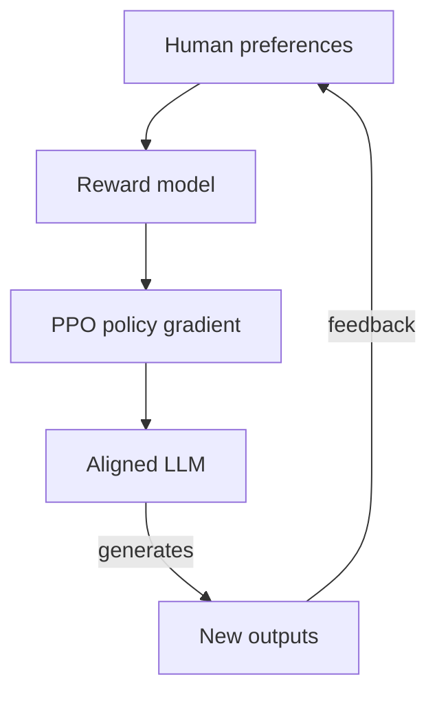
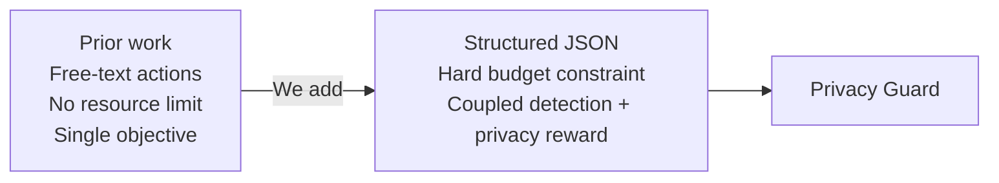

## Related Work: RL for LLM Agents

The idea of using reinforcement learning to shape language model behaviour is not new. But the *setting* has shifted dramatically — from single-turn preference alignment to multi-turn agentic control with structured outputs and hard resource constraints. Here's the lineage, with real papers and code.

---

## Layer 1 — Training LLMs With Reward Signals

The field started with applying RL to sequence-level metrics that aren't differentiable. Early REINFORCE work (Ranzato et al., 2016) used policy gradients to optimise BLEU scores directly. **RLHF** (Christiano et al., 2017) scaled this by learning a *reward model* from human preference comparisons, then running PPO against it — the approach that produced InstructGPT and modern aligned assistants.



**Key papers:**
- [RLHF — Christiano et al. 2017](https://arxiv.org/abs/1706.03741)
- [InstructGPT — Ouyang et al. 2022](https://arxiv.org/abs/2203.02155)
- [Constitutional AI — Bai et al. 2022](https://arxiv.org/abs/2212.08073)

---

## Layer 2 — From Single-Turn to Agentic Multi-Step

RLHF trains on single model outputs. Agentic RL trains on *trajectories* — sequences of observations, actions, and rewards across many steps. Three projects defined this space:

| Project | What it does | Code |
|---|---|---|
| **ReAct** | Interleaves reasoning traces + tool calls | [github.com/ysymyth/ReAct](https://github.com/ysymyth/ReAct) |
| **Voyager** | LLM generates reusable code skills in Minecraft | [github.com/MineDojo/Voyager](https://github.com/MineDojo/Voyager) |
| **ALFWorld** | Language agents in text-based household environments | [github.com/alfworld/alfworld](https://github.com/alfworld/alfworld) |
| **WebGPT** | Web-browsing agent trained with human feedback | [openai.com/research/webgpt](https://openai.com/research/webgpt) |

The common theme: the agent reasons, acts, and gets feedback from an environment — not from a human rater scoring a single completion.

---

## Layer 3 — GRPO: Group Relative Policy Optimisation

The algorithm we use is **GRPO** (Shao et al., 2024 — [DeepSeekMath](https://arxiv.org/abs/2402.03300)). The key insight: instead of training a separate value network (expensive, unstable), normalise rewards *within a group* of rollouts on the same prompt.

For a group of G rollouts with rewards {r₁ … rG}, the advantage for rollout i is:

```
Â_i = (r_i − mean(r₁…rG)) / std(r₁…rG)
```

No critic network. No moving baseline. Just within-batch normalisation. This is what makes GRPO tractable for multi-turn agentic tasks where PPO's value head would be computing over long, variable-length trajectories.

**Where GRPO has been applied:**
- Mathematical reasoning → [DeepSeekMath](https://github.com/deepseek-ai/DeepSeek-Math)
- Code generation → [DeepSeek-R1](https://github.com/deepseek-ai/DeepSeek-R1)
- Agentic tool use → [verifiers (Prime Intellect)](https://github.com/PrimeIntellect-ai/verifiers)

**Our use:** GRPO over 20-turn smart home episodes, where the reward is computed once at the end of the episode and normalised within a batch of 8 rollouts per scenario.

---

## How Privacy Guard Extends Prior Work

Prior LLM agent RL work uses free-form language or loosely structured API strings as outputs. We add three constraints that make the problem qualitatively harder:



| Dimension | Prior agentic RL | Privacy Guard |
|---|---|---|
| Action type | Free-form / API strings | Strongly-typed JSON |
| Resource constraint | None | Hard budget; runs out mid-episode |
| Reward structure | Single objective | Coupled: detection × privacy × format |

The result: standard reward hacking strategies (just ESCALATE every turn) immediately backfire — they exhaust the budget and produce zero privacy reward. The agent *must* learn frugality as a precondition for detection.

---

*Next: [Problem Formulation and Environment](/papers/2026-03-13-privacy-guard) — the full POMDP setup, scenario taxonomy, and action space.*
